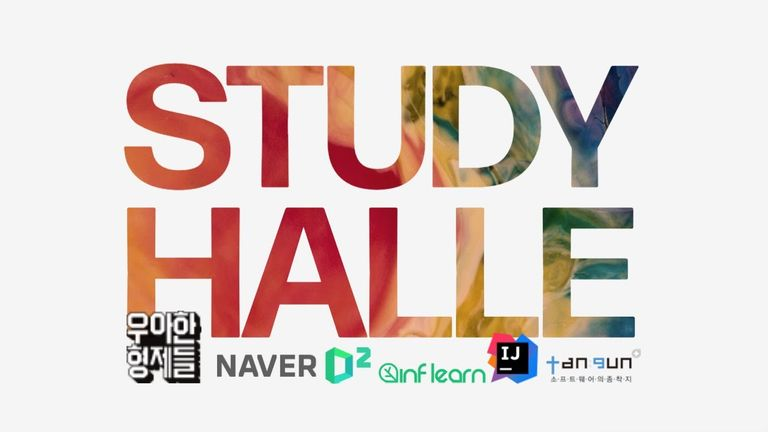

# 📝 White Ship Java Study

 - 백기선 선장님의 자바 스터디를 진행하면서 작성한 실습 코드를 올리는 Repository 입니다.  
 - 자바 정리는 **제 블로그에**서 했으며 👉[여기](https://alkhwa-113.tistory.com/category/WhiteShip%20Java%20Study%20:%20%EC%9E%90%EB%B0%94%20%EC%B2%98%EC%9D%8C%EB%B6%80%ED%84%B0%20%EB%A9%80%EB%A6%AC%EA%B9%8C%EC%A7%80?page=1)
에서 확인하실 수 있습니다.  
 - 스터디 **깃허브**는 👉[여기](https://github.com/whiteship/live-study) 입니다.
 - 깃허브의 이슈를 통해 매 주차의 과제를 볼 수 있습니다.
 - 스터디는 백기선님의 **유튜브**로 매주 토요일 진행하며 유튜브 주소는 👉[여기](https://www.youtube.com/watch?v=A_zgihtbG3M&t=5709s) 입니다.
 
 

--- 

👆 기본서 기본 예제 수준을 넘어서 왜 자바를 그렇게 만들었는지를 공부하기  
👆 자바가 우리를 위해 제공하는 다양한 기능들을 공부하기  
👆 깊이 있는 자바 공부를 위해 !

 
 

--- 

#### Index
 - [x] 1주차 : [JVM 은 무엇이며 자바 코드는 어떻게 실행하는 것인가](https://alkhwa-113.tistory.com/entry/1%EC%A3%BC%EC%B0%A8-JVM%EC%9D%80-%EB%AC%B4%EC%97%87%EC%9D%B4%EB%A9%B0-%EC%9E%90%EB%B0%94-%EC%BD%94%EB%93%9C%EB%8A%94-%EC%96%B4%EB%96%BB%EA%B2%8C-%EC%8B%A4%ED%96%89%ED%95%98%EB%8A%94-%EA%B2%83%EC%9D%B8%EA%B0%80?category=921157)
 - [x] 2주차 : [자바 데이터타입, 변수 그리고 배열](https://alkhwa-113.tistory.com/entry/2%EC%A3%BC%EC%B0%A8-%EC%9E%90%EB%B0%94-%EB%8D%B0%EC%9D%B4%ED%84%B0-%ED%83%80%EC%9E%85-%EB%B3%80%EC%88%98-%EA%B7%B8%EB%A6%AC%EA%B3%A0-%EB%B0%B0%EC%97%B4?category=921157)
 - [x] 3주차 : [연산자](https://alkhwa-113.tistory.com/entry/3%EC%A3%BC%EC%B0%A8-%EC%97%B0%EC%82%B0%EC%9E%90?category=921157)
 - [x] 4주차 : [제어문](https://alkhwa-113.tistory.com/entry/4%EC%A3%BC%EC%B0%A8-%EC%A0%9C%EC%96%B4%EB%AC%B8?category=921157), [Github API 를 이용한 라이브 스터디 대시보드](https://alkhwa-113.tistory.com/entry/4%EC%A3%BC%EC%B0%A8-%EA%B3%BC%EC%A0%9C?category=921157)
 - [x] 5주차 : [클래스](https://alkhwa-113.tistory.com/entry/5%EC%A3%BC%EC%B0%A8-%ED%81%B4%EB%9E%98%EC%8A%A4?category=921157)
 - [x] 6주차 : [상속](https://alkhwa-113.tistory.com/entry/6%EC%A3%BC%EC%B0%A8-%EC%83%81%EC%86%8D?category=921157), [디스패치 더블 디스패치](https://alkhwa-113.tistory.com/entry/%EB%94%94%EC%8A%A4%ED%8C%A8%EC%B9%98-%EB%8B%A4%EC%9D%B4%EB%82%98%EB%AF%B9-%EB%94%94%EC%8A%A4%ED%8C%A8%EC%B9%98-%EB%8D%94%EB%B8%94-%EB%94%94%EC%8A%A4%ED%8C%A8%EC%B9%98?category=921157)
 - [x] 7주차 : [패키지](https://alkhwa-113.tistory.com/entry/7%EC%A3%BC%EC%B0%A8-%ED%8C%A8%ED%82%A4%EC%A7%80?category=921157)
 - [x] 8주차 : [인터페이스](https://alkhwa-113.tistory.com/entry/8%EC%A3%BC%EC%B0%A8-%EC%9D%B8%ED%84%B0%ED%8E%98%EC%9D%B4%EC%8A%A4?category=921157)
 - [x] 9주차 : [예외처리](https://alkhwa-113.tistory.com/entry/9%EC%A3%BC%EC%B0%A8-%EC%98%88%EC%99%B8-%EC%B2%98%EB%A6%AC?category=921157)
 - [x] 10주차 : [멀티스레드 프로그래밍](https://alkhwa-113.tistory.com/entry/10%EC%A3%BC%EC%B0%A8-%EB%A9%80%ED%8B%B0%EC%8A%A4%EB%A0%88%EB%93%9C-%ED%94%84%EB%A1%9C%EA%B7%B8%EB%9E%98%EB%B0%8D?category=921157)
 - [x] 11주차 : [enum](https://alkhwa-113.tistory.com/entry/11%EC%A3%BC%EC%B0%A8-enum?category=921157)
 - [x] 12주차 : [Annotation](https://alkhwa-113.tistory.com/entry/12%EC%A3%BC%EC%B0%A8-Annotation?category=921157)

 
 

